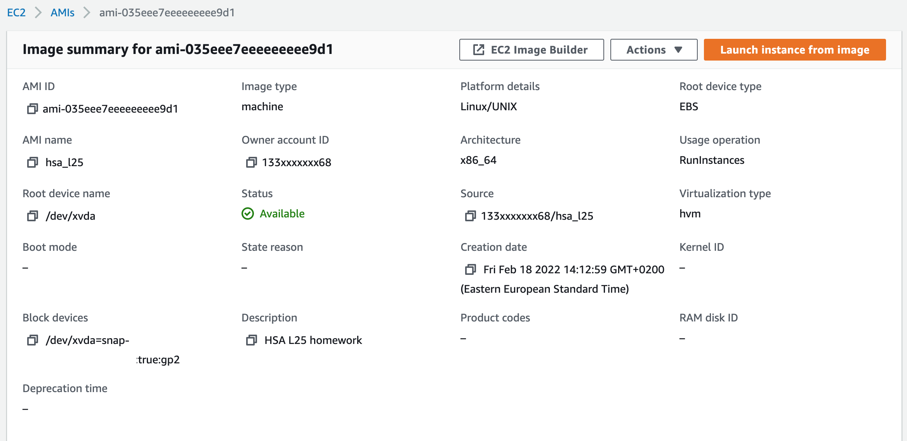
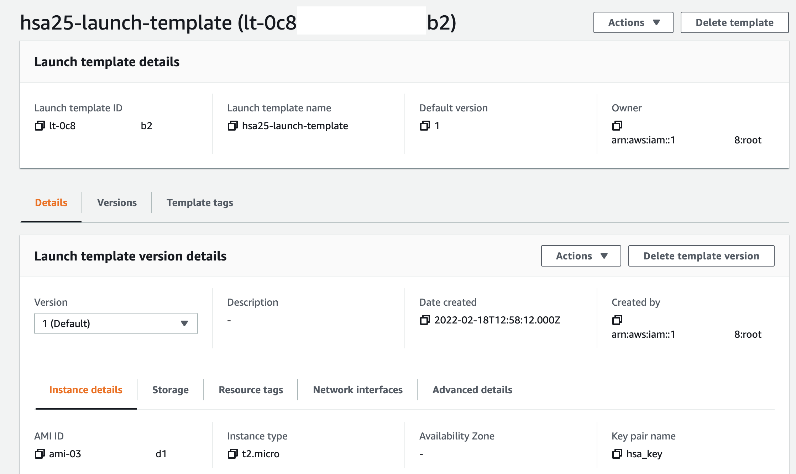
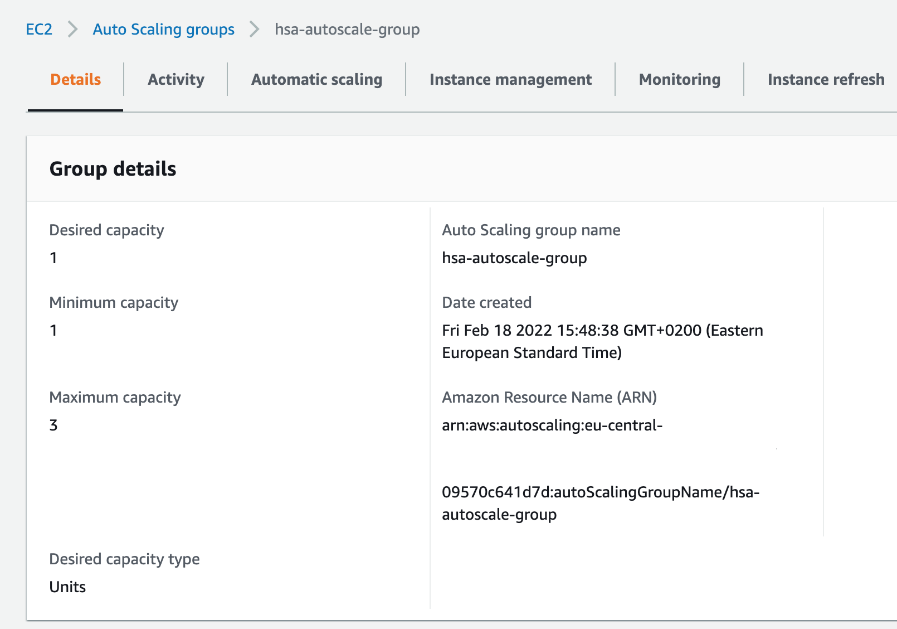
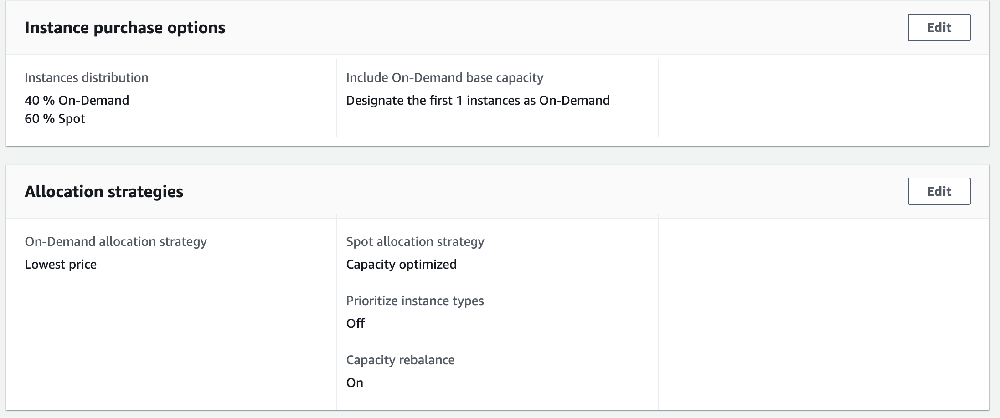
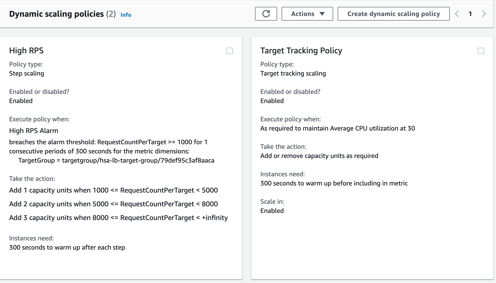
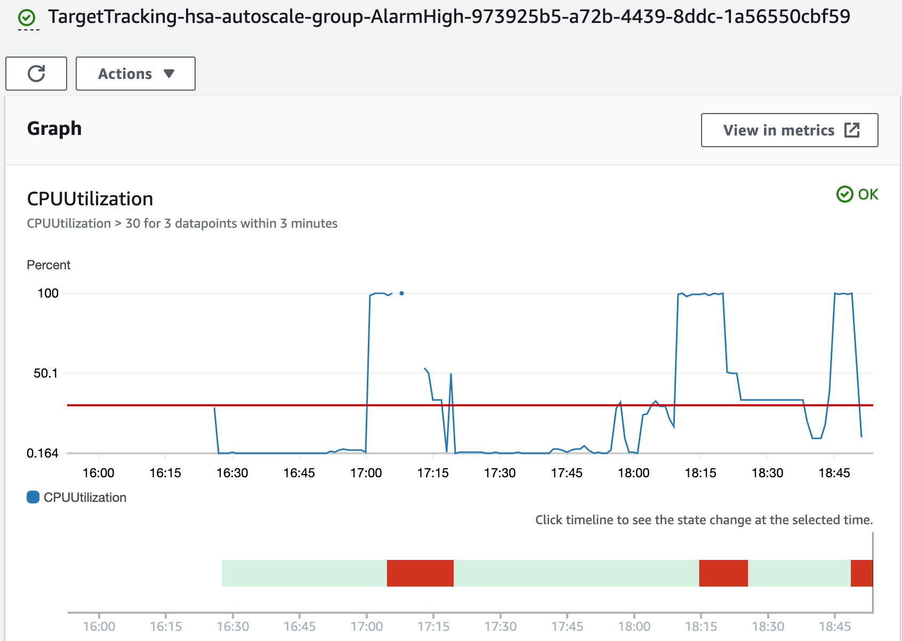
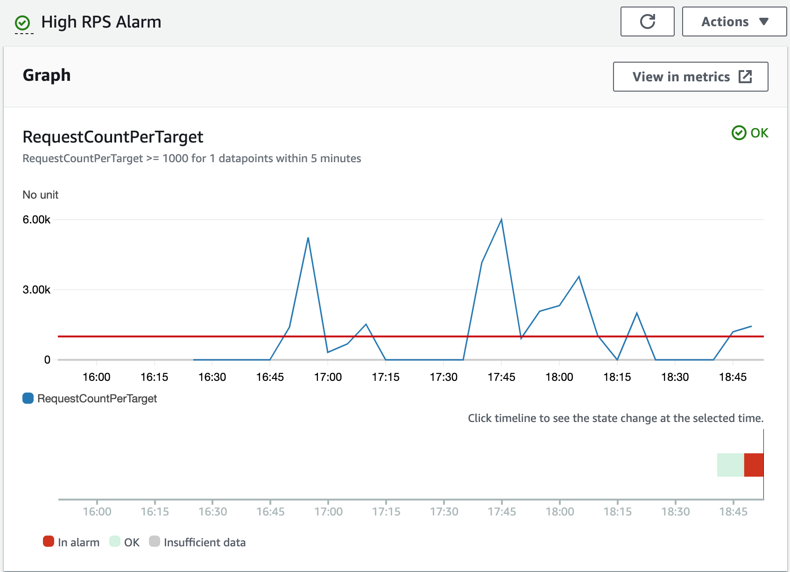
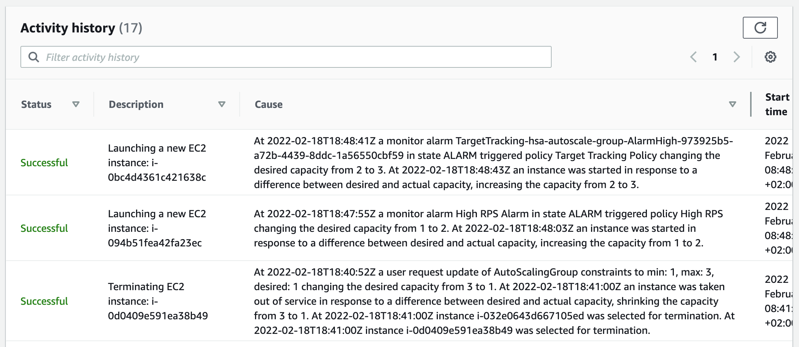
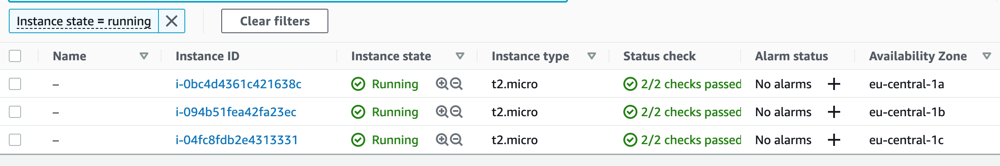

# HSA L25: AWS autoscale groups

## Task
* Create an auto-scale group that will contain one on-demand instance and will scale on spot instances
* Set up scaling policy based on AVG CPU usage
* Set up scaling policy based on request amount that allows non-linear growth

## Getting Started

#### 1. Create AMI Image


#### 2. Create Launch Template


#### 3. Create Auto Scaling Group
Details:


Instance Purchase Options:


Dynamic Scaling Options:


## Tests
### Check auto-scaling. Run the benchmark load test:
```bash
$ siege -b -c1000 -t10m hsa-lb-autoscale-1876688932.eu-central-1.elb.amazonaws.com
```

CloudWatch CPU Utilization Alarm:


CloudWatch High RPS Alarm:


Auto-scaling group activity history:


Auto-scaling running instances:
